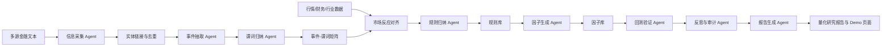

# AlphaLens 第一阶段工作稿

项目名称：AlphaLens：基于大模型规则归纳的舆情另类因子挖掘与量化研究智能体

副标题：面向事件驱动投资的多源信息归纳、因子生成与回测验证 Agent

版本：v0.1

日期：2026-07-12

资料依据：
- 浙江大学经济学院通知：《关于第一届“工行杯”浙江大学金融科技创新大赛的通知》，发布日期 2026-06-17。
- 参考论文：RIFT: Rule-Induced Framework for Single-Source Cross-Dataset Generalization in Rumor Detection。

## A. 比赛通知解读

### 1. 赛事定位

第一届“工行杯”浙江大学金融科技创新大赛聚焦金融科技领域创新前沿，强调将教育、科技、人才实践平台结合起来，鼓励学生围绕真实金融业务场景提出具有技术创新、应用价值和落地潜力的项目。

通知中同时提到，校赛将择优推荐重点优秀项目参加第五届中国研究生金融科技创新大赛、第十七届“工行杯”全国大学生金融科技创新大赛以及其他创新创业竞赛。因此，本项目不能只做概念展示，而应形成可运行 Demo、技术文档、项目路演材料和较完整的创新闭环。

### 2. 赛道与本项目适配判断

本届大赛设置两类参赛赛道：

- 揭榜挂帅赛道：企业命题、真实数据，共 27 道赛题，技术领域包括金融大模型与智能体、智能风控与量化建模、知识图谱与智能推荐、多模态技术与数据治理。
- 自拟赛题赛道：自主选题、创新应用，方向覆盖科技金融、绿色金融、普惠金融、养老金融、数字金融，并鼓励人工智能、大数据、区块链、云计算、信创、物联网等前沿技术在金融场景的创新应用。

AlphaLens 更适合以自拟赛题参赛，原因是本项目主题明确、创新链条完整，且不是简单套用企业题目数据，而是围绕“AI 量化研究智能体”自主定义金融科技场景。对外包装时，可以主动对齐以下评价口径：

- 金融大模型与智能体：多 Agent 协作完成信息采集、事件理解、规则归纳、因子生成、回测和报告撰写。
- 智能风控与量化建模：将非结构化舆情转化为风险因子、动量因子、预期差因子，并通过 IC、Rank IC、分组收益、多空组合等指标验证。
- 知识图谱与智能推荐：实体链接到股票、行业、概念、产业链节点，形成事件-实体-谓词-规则-因子的可解释知识链。

### 3. 参赛对象与团队边界

通知要求具有正式学籍的在校本科生、研究生均可报名参赛；参赛者须以团队形式报名，每支队伍不超过 6 名学生，可选 1-2 名指导教师。若同步报名第十七届“工行杯”全国大学生金融科技创新大赛，团队不超过 3 人。

建议 AlphaLens 以 3-5 人配置推进，核心岗位包括数据工程、LLM/Agent、量化回测、前端可视化、文档答辩。若考虑国赛团队 3 人限制，应提前设计“核心三人版”职责合并方案。

### 4. 关键时间节点

- 校赛报名：即日起至 2026-08-17。
- 作品提交：即日起至 2026-08-31 15:00。
- 校赛时间：2026 年 9 月上旬。
- 国赛阶段：2026 年 10 月中下旬。

从 2026-07-12 起，距离校赛报名截止约 5 周，距离作品提交截止约 7 周。项目节奏应优先保证“可运行 MVP + 可信回测结果 + 清晰答辩故事”，后续再扩展多行业、多事件、多因子。

### 5. 提交形式与材料要求

校赛层面，参赛团队需加入校内比赛交流群，在 2026-08-17 前提交报名问卷，并向校赛邮箱提交可运行演示的项目成果和演示 PPT。

第五届中国研究生金融科技创新大赛层面，评审材料包括：

- 精益画布。
- 可运行项目成果，例如模型源代码、系统演示包。
- 技术文档。
- 原创性证明。

这意味着 AlphaLens 至少要准备四类交付物：

- 系统 Demo：可以输入文本、抽取事件、生成谓词、触发规则、输出因子和回测结果。
- 技术方案：说明数据、算法、Agent 架构、回测方法、审计机制。
- 商业/应用材料：精益画布、痛点、用户、场景、价值。
- 答辩材料：PPT、演示脚本、FAQ、创新性与落地性说明。

### 6. 评委可能关注的点

评委大概率会关注以下问题：

- 是否是真实金融场景，而不是泛泛 AI 概念。
- 是否有可运行系统，而不是只有 PPT。
- 是否有真实或可信的小样本数据闭环。
- 是否避免“LLM 直接预测股票涨跌”的监管和科学性风险。
- 是否能说明金融逻辑：事件为什么会影响收益、风险、波动或成交。
- 是否能说明量化验证逻辑：没有未来函数、样本内外切分、因子有效性指标完整。
- 是否有创新性：从情绪分数升级为事件谓词和规则归纳。
- 是否有可解释性：每个因子都能回溯到事件、谓词、规则和样本案例。
- 是否适合学生团队完成：MVP 范围可控，工程实现路径清晰。

## B. 项目完整立项方案

### 1. 项目定位

AlphaLens 是一个面向事件驱动投资研究的 AI 量化研究智能体。它不是投资建议系统，也不是让大模型直接预测股票涨跌，而是将新闻、公告、政策、互动问答、研报摘要、社交媒体舆情等非结构化信息转化为可解释、可回测、可复用的另类因子。

一句话定位：

AlphaLens 让大模型从“读新闻给观点”升级为“归纳事件规则、生成另类因子、用回测验证假设”的自动化量化研究助手。

### 2. 项目背景

传统量化因子主要来自行情、财务、估值、资金流等结构化数据。随着金融市场信息传播速度提升，新闻、公告、政策、互动问答和社交舆情正在更早反映企业经营变化、预期差和风险扩散。但这类文本数据存在非结构化、噪声高、跨行业语义差异大、难以回测复用等问题。

传统舆情因子通常采用“文本情绪分类 - 情绪分数 - 因子值”的路线，难以回答更关键的问题：这条信息是什么事件？影响哪家公司？影响路径是什么？是否涉及主营业务？市场过去如何反应？这个规律是否可回测？

AlphaLens 的核心思路是将非结构化文本转成事件谓词，再从历史样本中归纳规则，将规则转为因子，并通过回测验证。它借鉴参考论文的底层思想：从复杂样本中抽取可解释谓词，从历史数据归纳可迁移规则，将规则作为软证据注入 LLM/Agent 推理，而不是照搬论文的谣言检测任务。

### 3. 痛点分析

传统新闻情绪因子的主要痛点：

- 只判断正负面情绪，不理解事件结构。
- 无法区分真正影响基本面的信息和普通噪声。
- 缺少“影响路径”，例如政策是否直接作用于公司主营业务。
- 跨行业泛化弱，同样的正面词在不同行业含义不同。
- 因子缺乏解释性，难以被研究员复盘。
- 无法自动发现新的因子假设。
- 容易把大模型输出当结论，缺少回测审计。

AlphaLens 要解决的是“舆情文本如何变成研究假设，再变成可验证因子”的完整闭环。

### 4. 解决方案

系统流程：

多源金融文本 -> 实体链接 -> 事件抽取 -> 谓词化表示 -> 历史市场反应对齐 -> 规则归纳 -> 因子生成 -> 回测验证 -> 研究报告生成

核心机制：

- 用 LLM 将文本转化为结构化事件，而不是直接输出涨跌判断。
- 用谓词 schema 表达事件属性、证据强度、影响路径和舆情扩散结构。
- 用历史样本将谓词组合与未来收益、波动、回撤、成交异常对齐。
- 用规则评分筛选有统计证据的候选规则。
- 用规则触发频率、强度、时效性和扩散速度构造另类因子。
- 用量化回测和审计 Agent 检查因子是否真实有效。
- 自动生成研究报告，说明假设、公式、样本、结果、适用场景和失效风险。

### 5. 核心创新

创新一：从情绪分数升级到事件规则。

传统方法问“这条新闻正面还是负面”，AlphaLens 问“这是什么事件、作用于谁、通过什么路径影响预期、过去类似规则是否有效”。

创新二：从人工构造因子升级到 Agent 自动归纳因子。

研究员不再完全手工提出因子，而是让 Agent 从历史事件样本中发现“谓词组合 - 市场反应”的候选规律，再由回测审计筛选。

创新三：从黑箱因子升级到可解释另类因子。

每个因子都能回溯到触发规则、代表事件、历史样本、回测指标和失效风险。

创新四：从单步 LLM 分析升级到多智能体量化研究工作流。

信息采集、事件抽取、谓词归纳、规则归纳、因子生成、回测验证、审计反思、报告生成分别由 Agent 协作完成。

创新五：将参考论文的规则归纳思想迁移到金融量化研究。

参考论文将文本、对话、传播信号抽象为布尔谓词，并从历史样本中归纳可迁移规则。AlphaLens 将这一思想迁移为“金融事件谓词 - 市场反应规则 - 可回测另类因子”的金融科技创新框架。

### 6. 传统方法与 AlphaLens 对比

| 方法 | 输入 | 核心机制 | 输出 | 主要问题 | AlphaLens 优势 |
|---|---|---|---|---|---|
| 普通新闻情绪因子 | 新闻标题/正文 | 情感分类 | 正负面分数 | 语义粗糙、解释弱 | 识别事件类型、影响路径和证据强度 |
| 传统 NLP 舆情分析 | 新闻/社媒 | 分类、主题、情绪 | 舆情标签 | 与市场反应脱节 | 对齐未来收益、波动和风险 |
| 人工量化研究流程 | 研究员经验 + 数据 | 手工构造因子 | 因子报告 | 慢、覆盖窄、难扩展 | Agent 自动提出并验证因子假设 |
| 传统事件驱动策略 | 预定义事件 | 规则交易/事件窗口 | 策略信号 | 规则依赖人工，泛化弱 | 从历史样本归纳规则并持续更新 |
| AlphaLens | 多源文本 + 市场数据 | 事件抽取、谓词归纳、规则归纳、因子回测 | 可解释另类因子 + 报告 | 需要数据和严谨验证 | 自动化、可解释、可回测、可审计 |

### 7. 应用价值

对量化研究：

- 自动发现舆情类另类因子。
- 提高事件驱动研究效率。
- 将文本信息纳入可回测框架。

对金融机构：

- 辅助投研、风控和组合管理。
- 识别政策、监管、供应链、盈利质量、互动问答等事件风险。
- 沉淀可复用规则库和事件知识库。

对比赛展示：

- 兼具 AI Agent、金融量化、知识工程和可视化演示。
- 有明确业务场景和可运行 MVP。
- 可清晰说明“不提供投资建议，只做研究辅助和因子验证”。

### 8. 可行性分析

技术可行：

- LLM 可完成事件抽取、实体识别、谓词判断和报告生成。
- 规则归纳可从单谓词、二阶谓词组合起步，搜索空间可控。
- 因子回测可先采用日频行情、小样本股票池和基础指标。
- 前端可用轻量 Web 页面展示事件、规则、因子和回测图表。

数据可行：

- 公司公告可从交易所、巨潮资讯等公开来源获取。
- 股票行情可用开源接口或本地 CSV 数据。
- 互动问答可选取公开平台小样本人工整理。
- 新闻和政策可先用公开网页、小样本标注或模拟数据。

团队可行：

- 第一版 MVP 限定一个行业、一类事件、一个因子、一套回测。
- 不追求覆盖全 A 股，优先展示闭环能力。

### 9. 风险与局限

- 数据获取风险：部分新闻、研报和社媒数据可能受版权或接口限制。应优先使用公开公告、政策文件和可引用新闻摘要。
- LLM 抽取误差：事件抽取和谓词判断可能出错。应支持人工校正和抽样审计。
- 小样本过拟合：规则可能只对历史样本有效。应进行样本外测试、因子衰减分析和稳健性检验。
- 未来函数风险：因子生成必须只使用当时可获得的信息。公告发布时间、新闻发布时间、调仓日都要严格处理。
- 金融合规风险：输出应定位为研究辅助和教学演示，不构成投资建议。

## C. MVP 实施路线

### 1. MVP 范围建议

推荐 MVP 选择：

- 行业：新能源或半导体。
- 事件：政策利好 + 互动问答关注度上升。
- 股票池：行业内 30-80 只股票。
- 时间周期：2023-01-01 至 2026-06-30，若数据不足可缩短到 2024-2026。
- 因子：policy_attention_momentum_score。
- 回测：周频调仓，持有 5 个交易日或 10 个交易日。
- 展示：输入文本 -> 事件表 -> 谓词表 -> 规则触发 -> 因子排名 -> 回测结果 -> 自动报告。

选择政策利好作为第一类事件的原因：

- 公开政策文本容易获取。
- 金融逻辑容易解释。
- 行业主题动量与政策相关性强，适合比赛讲述。
- 可与新闻热度、互动问答关注度结合形成事件扩散因子。

备选 MVP：

- 银行业：监管处罚 / 资本充足率 / 舆情负面扩散 -> regulatory_risk_score。
- 医药：集采政策 / 产品审批 / 研发进展 -> policy_or_approval_event_score。
- 房地产：政策放松 / 融资支持 / 债务风险 -> expectation_gap_score。

### 2. MVP 数据表设计

文本原始表 raw_documents：

| 字段 | 含义 |
|---|---|
| doc_id | 文档 ID |
| source_type | news / announcement / policy / ir_qa / social |
| title | 标题 |
| content | 正文或摘要 |
| publish_time | 发布时间 |
| url | 来源链接 |
| source_name | 来源名称 |

实体链接表 entity_links：

| 字段 | 含义 |
|---|---|
| doc_id | 文档 ID |
| stock_code | 股票代码 |
| stock_name | 股票简称 |
| industry | 行业 |
| concept | 概念 |
| confidence | 实体链接置信度 |

事件表 events：

| 字段 | 含义 |
|---|---|
| event_id | 事件 ID |
| doc_id | 文档 ID |
| stock_code | 股票代码 |
| event_type | 事件类型 |
| event_time | 事件时间 |
| subject | 主体 |
| object | 客体 |
| impact_path | 影响路径 |
| evidence_text | 证据片段 |
| evidence_strength | 证据强度 |

谓词表 predicates：

| 字段 | 含义 |
|---|---|
| event_id | 事件 ID |
| predicate_name | 谓词名 |
| value | true / false / score |
| confidence | 置信度 |
| rationale | 判断理由 |

规则表 rules：

| 字段 | 含义 |
|---|---|
| rule_id | 规则 ID |
| rule_expr | 谓词组合 |
| target_reaction | 市场反应 |
| support | 覆盖样本数 |
| score | 规则评分 |
| ic | 因子 IC |
| description | 可解释描述 |

因子表 factors：

| 字段 | 含义 |
|---|---|
| trade_date | 交易日 |
| stock_code | 股票代码 |
| factor_name | 因子名称 |
| factor_value | 因子值 |
| raw_trigger_count | 原始触发次数 |
| standardized_value | 标准化值 |

### 3. MVP 因子定义

因子名称：policy_attention_momentum_score

适用场景：新能源或半导体行业政策利好事件。

核心假设：当政策利好直接作用于公司主营业务，且新闻或互动问答关注度在短期内快速上升时，相关股票可能出现短期主题动量或成交活跃度提升。

候选谓词：

- has_policy_support
- policy_directly_related_to_business
- event_mentions_core_product
- social_attention_spikes
- institutional_attention_increases
- event_has_short_term_price_impact

规则示例：

has_policy_support AND policy_directly_related_to_business AND social_attention_spikes -> short_term_theme_momentum

基础计算公式：

```text
policy_attention_momentum_score_i,t =
  zscore_industry(
    1.0 * policy_direct_match_i,t
  + 0.6 * attention_acceleration_i,t
  + 0.4 * evidence_strength_i,t
  + 0.3 * institutional_attention_i,t
  )
```

其中：

- policy_direct_match：政策事件是否与公司主营业务直接相关。
- attention_acceleration：过去 3 日相关文本数量相对过去 20 日均值的增长。
- evidence_strength：事件证据强度，可由公告、政策原文、权威新闻权重决定。
- institutional_attention：研报摘要、机构关注或互动问答中的关注度变化。

回测设置：

- 调仓频率：周频。
- 持有期：5 或 10 个交易日。
- 股票池：选定行业股票。
- 分组：按因子值分为 5 组或 3 组。
- 评估：Rank IC、ICIR、分组收益、多空收益、最大回撤、Sharpe、换手率。
- 中性化：至少做行业内标准化；若股票池跨行业，再做行业和市值中性化。

### 4. MVP Demo 流程

现场演示脚本：

1. 输入一批政策新闻、公司公告和互动问答文本。
2. 信息采集 Agent 识别来源、发布时间、关联公司和行业。
3. 事件抽取 Agent 生成结构化事件表。
4. 谓词归纳 Agent 输出每个事件的布尔谓词和置信度。
5. 规则归纳 Agent 展示历史样本中发现的规则。
6. 因子生成 Agent 将规则触发转为股票-日期因子值。
7. 回测验证 Agent 展示 IC、分组收益、多空收益和回撤。
8. 反思与审计 Agent 提醒样本量、未来函数、失效风险。
9. 报告生成 Agent 自动输出一页量化研究报告。

### 5. 五周开发计划

第 1 周：方案和数据底座。

- 固定 MVP 行业和事件类型。
- 整理 100-300 条文本样本。
- 准备行情数据和股票池。
- 完成事件 schema、谓词 schema、规则表设计。

第 2 周：事件抽取和谓词化。

- 实现 LLM 事件抽取 prompt。
- 实现实体链接和股票代码匹配。
- 实现谓词判断 prompt 和人工校正界面。
- 产出第一版事件-谓词矩阵。

第 3 周：规则归纳和因子生成。

- 实现单谓词、双谓词、三谓词组合搜索。
- 对齐未来收益、波动、回撤、成交量异常。
- 实现规则评分和 Top-K 规则库。
- 生成第一版因子。

第 4 周：回测和可视化。

- 实现 IC、Rank IC、ICIR、分组收益、多空组合。
- 检查未来函数和样本内外切分。
- 完成可视化页面：文本、事件、规则、因子、回测。

第 5 周：答辩材料和系统打磨。

- 完成 PPT、技术文档、精益画布、原创性证明。
- 准备 Demo 脚本和 FAQ。
- 做 2-3 个解释案例。
- 优化界面和报告生成。

## D. 技术架构

### 1. 总体架构



### 2. 多 Agent 职责、输入、输出

| Agent | 输入 | 处理 | 输出 |
|---|---|---|---|
| 信息采集 Agent | 新闻、公告、政策、互动问答、社媒文本 | 抓取、清洗、去重、来源标记 | raw_documents |
| 实体链接 Agent | 文本、股票简称、行业、概念词典 | 公司/行业/概念匹配 | entity_links |
| 事件抽取 Agent | raw_documents + entity_links | 抽取主体、客体、事件类型、时间、影响路径 | events |
| 谓词归纳 Agent | events + 原文证据 | 判断布尔谓词、置信度、理由 | predicates |
| 规则归纳 Agent | 事件-谓词矩阵 + 未来市场反应 | 搜索候选规则、评分、筛选 | rules |
| 因子生成 Agent | rules + 事件触发记录 | 计算因子值、标准化、中性化 | factors |
| 回测验证 Agent | factors + 行情数据 | IC、分组收益、多空、风险指标 | backtest_results |
| 反思与审计 Agent | 规则、因子、回测结果 | 检查未来函数、样本量、过拟合、结论强度 | audit_notes |
| 报告生成 Agent | 全部中间结果 | 生成研究报告和答辩摘要 | factor_report |

### 3. 事件抽取方法

事件抽取采用 LLM + schema 约束输出：

```json
{
  "event_type": "policy_support",
  "subject": "某部委/地方政府/公司",
  "object": "某行业/某产品/某公司",
  "stock_codes": ["000000.SZ"],
  "event_time": "2026-01-01",
  "impact_path": "政策支持 -> 行业需求提升 -> 公司主营产品订单预期改善",
  "evidence_text": "原文证据片段",
  "evidence_strength": 0.85
}
```

第一版建议事件类型控制在 6-10 类：

- policy_support
- regulatory_penalty
- inquiry_letter_pressure
- earnings_quality_anomaly
- product_price_increase
- supply_chain_disruption
- capacity_expansion
- investor_question_pressure
- management_response_vague
- negative_opinion_diffusion

### 4. 谓词 schema

谓词设计原则：

- 可解释：每个谓词能用自然语言说明。
- 可计算：能从文本、事件、行情或财务数据中判断。
- 可迁移：不绑定某个单独股票或新闻。
- 可审计：保留证据文本和置信度。

MVP 谓词：

| 谓词 | 含义 |
|---|---|
| has_policy_support | 文本包含明确政策支持 |
| policy_directly_related_to_business | 政策与公司主营业务直接相关 |
| event_mentions_core_product | 事件提及公司核心产品 |
| social_attention_spikes | 舆情/文本关注度短期上升 |
| institutional_attention_increases | 机构关注或研报提及增加 |
| evidence_from_authoritative_source | 证据来自权威来源 |
| announcement_contains_uncertainty | 公告或回应包含不确定性表达 |
| investor_questions_increase | 投资者提问数量增加 |
| management_response_vague | 管理层回应模糊 |
| event_has_short_term_price_impact | 类似事件历史上出现短期价格反应 |

### 5. 规则归纳方法

借鉴参考论文的“谓词矩阵 -> 候选规则 -> 规则评分 -> 规则库”思想。

候选规则形式：

```text
p_a -> market_reaction
p_a AND p_b -> market_reaction
p_a AND p_b AND p_c -> market_reaction
```

市场反应标签可以包括：

- future_return_positive：未来 5/10 日超额收益为正。
- future_volatility_up：未来波动率上升。
- drawdown_risk_up：未来最大回撤上升。
- volume_attention_up：未来成交量异常放大。

规则评分：

```text
score(rule) =
  coverage_positive(rule)
  - lambda * coverage_negative(rule)
  + alpha * avg_future_excess_return(rule)
  + beta * rank_ic(rule)
  - gamma * instability_penalty(rule)
```

筛选条件：

- 样本数不低于阈值，例如 support >= 10。
- 样本外 Rank IC 不显著恶化。
- 规则不能过长，MVP 控制在 1-3 个谓词。
- 对应金融逻辑必须可解释。

### 6. 因子生成方法

将规则触发转为因子值：

```text
factor_i,t =
  sum over rules [
    rule_score_r
    * trigger_i,t,r
    * recency_decay_i,t,r
    * evidence_weight_i,t,r
  ]
```

其中：

- trigger_i,t,r：股票 i 在 t 日是否触发规则 r。
- recency_decay：事件越新权重越高，例如 exp(-days_since_event / tau)。
- evidence_weight：公告、政策原文、权威媒体权重高于普通转载。
- rule_score：历史规则评分。

标准化：

- 缺失值填 0 或行业内中位数，需在报告中说明。
- 行业内 z-score。
- 市值中性化：对 log_mktcap 回归取残差。
- 极值处理：MAD 或 winsorize。

### 7. 回测评估方法

必须包含：

- IC。
- Rank IC。
- ICIR。
- 分组收益。
- 多空组合收益。
- 年化收益。
- 最大回撤。
- Sharpe Ratio。
- 换手率。
- 行业中性化。
- 市值中性化。
- 样本内 / 验证集 / 测试集。
- 因子衰减分析。
- 稳健性检验。

反未来函数要求：

- 只使用 event_time 或 publish_time 已经发生的信息。
- 当日盘后公告只能用于下一交易日。
- 训练规则只用训练期数据，测试期只做触发和评估。
- 不用未来收益参与测试期因子计算。

### 8. 参考论文思想迁移关系

| 参考论文模块 | 原任务含义 | AlphaLens 迁移 |
|---|---|---|
| Source dataset | 有标签谣言数据 | 历史金融事件 + 后续市场反应 |
| Event and replies | 原帖和早期回复 | 新闻、公告、问答、社媒扩散 |
| Predicate schema | 谣言相关语义谓词 | 金融事件、证据、影响路径、扩散谓词 |
| Event-predicate matrix | 事件是否满足谓词 | 股票-事件是否触发谓词 |
| Rule induction | 谓词组合 -> 谣言 | 谓词组合 -> 收益/风险/波动反应 |
| Rulebook | 可迁移谣言规则 | 可解释另类因子规则库 |
| Rule-enhanced inference | 规则增强 LLM 判断 | 规则增强 Agent 因子生成与报告解释 |

重要边界：AlphaLens 不做谣言检测，也不照搬论文任务，只借鉴其“从样本抽象谓词、从谓词归纳规则、用规则增强泛化与解释”的底层技术范式。

## E. 后续行动清单

### 立即行动

- 确定 MVP 行业：建议新能源或半导体二选一。
- 确定 MVP 事件：建议先做“政策利好 + 关注度扩散”。
- 建立项目目录：data、src、notebooks、app、docs、outputs。
- 收集股票池：行业内 30-80 只股票，包含代码、简称、行业、市值。
- 准备行情数据：日频收盘价、成交量、涨跌幅、流通市值。
- 准备文本样本：100-300 条政策、新闻、公告、互动问答。
- 设计第一版 prompt：事件抽取 prompt、谓词判断 prompt、报告生成 prompt。

### 第一版原型

- 用 CSV 或 SQLite 保存 raw_documents、events、predicates、rules、factors。
- 实现一个命令行流水线：文本输入 -> 事件 JSON -> 谓词 JSON -> 规则触发 -> 因子值。
- 实现一个基础回测 notebook 或 Python 脚本。
- 生成一份自动研究报告 Markdown。

### Demo 页面

- 左侧：输入文本列表和关联股票。
- 中间：事件抽取结果、谓词矩阵、规则触发情况。
- 右侧：因子排名、回测曲线、分组收益、解释案例。
- 底部：自动生成研究报告和审计提醒。

### 答辩包装

项目一句话介绍：

AlphaLens 是一个将金融舆情文本自动转化为可解释另类因子，并用回测验证其有效性的 AI 量化研究智能体。

三个核心卖点：

- 事件级理解：不止做情绪分数，而是识别事件、主体、影响路径和证据强度。
- 规则级创新：从历史样本自动归纳“谓词组合 - 市场反应”规则，形成可解释规则库。
- 回测级闭环：所有因子必须经过 IC、分组收益、多空组合和审计 Agent 验证。

可能被问到的问题：

1. 你们是不是在用大模型预测股价？

不是。系统不输出买卖建议，也不让 LLM 直接预测涨跌。我们做的是另类因子挖掘与量化研究辅助，所有结论必须经过历史回测和审计。

2. 和新闻情绪因子有什么区别？

新闻情绪因子通常只判断正负面。AlphaLens 识别事件结构、影响路径、证据强度和扩散过程，再通过规则归纳转为可解释因子。

3. 数据不够怎么办？

MVP 先限定一个行业和一类事件，用公开公告、政策文本、新闻摘要、互动问答和行情数据构造小样本验证集。系统重点展示方法闭环，后续可接入更大规模数据源。

4. 如何防止规则过拟合？

采用训练、验证、测试时间切分；限制规则长度；设置 support 阈值；做样本外 Rank IC、因子衰减和稳健性检验；由审计 Agent 输出风险提示。

5. 参考论文和本项目关系是什么？

参考论文做的是谣言检测，我们不照搬任务。我们借鉴的是技术范式：将复杂文本样本转为可解释谓词，从历史样本中归纳规则，再将规则作为可迁移知识增强 LLM/Agent 的推理稳定性。

### 建议的下一步产物

- `docs/比赛解读.md`
- `docs/项目立项书.md`
- `docs/MVP技术方案.md`
- `docs/答辩FAQ.md`
- `data/sample/raw_documents.csv`
- `data/sample/market_data.csv`
- `src/pipeline/extract_events.py`
- `src/pipeline/ground_predicates.py`
- `src/pipeline/induce_rules.py`
- `src/backtest/factor_backtest.py`
- `app/` 可视化 Demo
