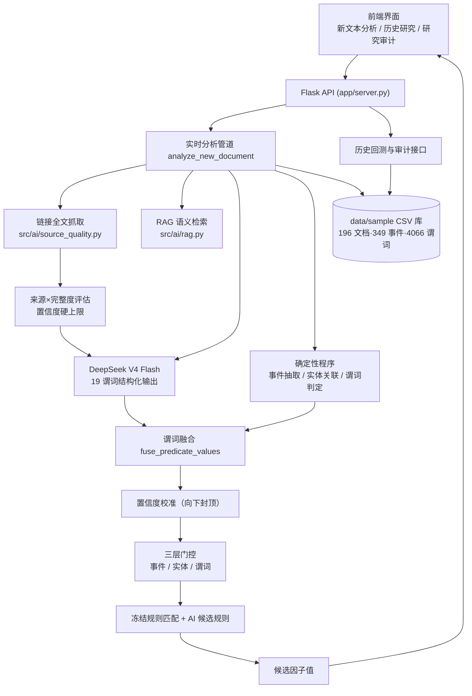

# AlphaLens 金融文本另类因子研究平台

> **一句话定位**：AlphaLens 将政策、公告、财经新闻和互动问答等非结构化金融文本，转化为可解释、可回测、可复用的另类因子研究素材。系统是量化研究助手，**不预测股票价格，不提供投资建议**。
>
> 版本 `AlphaLens-Demo-v1.0-R4` · DeepSeek V4 Flash · 19 谓词固定 Schema · 三层门控 · 36/36 自动化测试通过
>
> **本报告仅供研究参考，不构成投资建议**

---

## 录屏演示视频

- **随包视频**：`演示视频/AlphaLens_演示录屏.webm`（38 秒演示：新文本分析 → 储能政策（示例自动填入链接全文）→ 冻结回放 → 逐股票相关性因子 → 历史研究 → 研究审计）
- **在线视频**：（占位——评审如需在线版本，可上传至 B 站/腾讯视频/网盘后把链接填在这里）

## 项目源码仓库

- GitHub：`https://github.com/chiiiiiiing/Gonghangbei`（分支 `codex/demo-integration`）
- AtomGit：比赛要求源码托管于 AtomGit，可推送至 `https://atomgit.com/<账号>/AlphaLens`（按比赛要求创建仓库后 `git remote add atomgit <地址> && git push atomgit codex/demo-integration`）

---

## 一、产品文档

### 1.1 要解决的问题

量化研究中，政策、公告、新闻、互动问答等**非结构化文本**蕴含大量另类信息，但难以被机器直接使用：

| 痛点 | 传统做法 | AlphaLens 方案 |
|---|---|---|
| 文本无法回测 | 人工阅读、主观判断 | 文本 → 事件 → 谓词 → 因子 → 历史回测 |
| AI 幻觉不可信 | 大模型输出不设防 | 19 谓词固定 Schema + 三层门控 + 逐字证据回溯 |
| 黑箱不透明 | 因子不知从哪来 | 每个因子可追溯至原文片段、来源与规则 |
| 新旧割裂 | 新文本与历史研究脱节 | 实时路径与离线流水线共用同一套确定性程序 |

### 1.2 核心能力

1. **结构化抽取**：任意文本 → 主事件 + 关联股票 + 19 个标准谓词（政策支持、业绩异常、产能扩张等 9 类事件）。
2. **AI 深度参与但全程可审计**：DeepSeek V4 Flash 提出事件/谓词/规则候选；AI 谓词与确定性程序做**谓词融合**（一致采纳、冲突按 AI 置信度加权、AI 缺失回退规则值）。
3. **来源与完整度校准**（R4）：有正文链接自动抓取全文供 AI 阅读；AI 按**政策类型 / 来源 / 链接 / 文本完整度**四维校准置信度，仅摘要时上限 0.6、全文+权威来源最高 0.95。
4. **可回测、可复用的因子**：候选因子按行业等权超额收益做横截面五组分组 + Rank IC；Discovery（2024–2025）与 OOS（2026H1）**分开展示**，证据不足如实提示。
5. **逐股票相关性系数**：同一文本下不同股票按「关联方式置信度 × AI 业务相关性 × 行业代表度（市值排名）」获得不同的因子值，界面公式全程可追溯（如德业股份相关性 0.93 / 派能科技 0.77）。
6. **RAG 语义检索**：实时分析检索 163 篇历史 AI 标注结论注入 prompt，参考相似历史研究。
7. **完整审计**：来源、独立文档支持、未来函数检查、`adj_factor=1` 限制、AI 历史缓存覆盖全部如实披露。

### 1.3 三分钟演示

1. **新文本分析**：选「储能政策」示例 →（实时 AI 需填 DeepSeek Key；断网可选）**冻结回放** → 查看事件、关联股票、AI/确定性谓词对照与融合值、门控、候选因子。
2. **历史研究**：默认 OOS 视图看指标与「证据不足」诚实提示 → 切 Discovery 看因子收益分组与 Rank IC 时序。
3. **研究审计**：样本分区覆盖、来源核验、AI 标注缓存、未来函数与复权限制。

### 1.4 关键保证（可验证）

- 实时模式缺 Key / API 失败 / 未返回完整 19 谓词 → **直接报错**，不降级冒充。
- 三层门控（事件/实体/逐股票谓词），只有 `agreed_true` 触发冻结规则。
- 规则支持度按独立 `doc_id`、日期、股票覆盖共同判定。
- 回测按交易日横截面分组，收益为「个股 5 日收益 − 行业等权收益」。
- API Key 只随当次请求发送，不写入文件、CSV 或浏览器存储。
- 冻结回放使用已保存的结构化 AI 输出，页面持续标注「冻结回放」，不冒充实时结果。

---

## 二、系统架构



**模块职责**

| 模块 | 文件 | 职责 |
|---|---|---|
| 链接全文抓取 | `src/ai/source_quality.py` | HTML/PDF 尽力抓取，来源与完整度评估，置信度硬上限 |
| RAG 语义检索 | `src/ai/rag.py` | 内存向量索引，检索历史 AI 结论 |
| AI 研究层 | `src/ai/research_layer.py` | 调用 DeepSeek、结构校验、自动修复 |
| 实时分析管道 | `src/pipeline/live_analysis.py` | 谓词融合、门控、因子计算、置信度校准 |
| 规则与评分 | `src/research/scoring.py` | 证据评分、行业贝塔后验 |
| 回测 | `src/backtest/demo_engine.py` | 横截面五组、Rank IC |
| 服务端 | `app/server.py` | Flask API、冻结回放、审计、报告 |
| 前端 | `app/assets/app.js` | 交互界面、图表、下载报告 |

**数据口径**：输入受保护（`raw_documents.csv` 重算前后 SHA-256 强制比对）；行情为前复权日线；`adj_factor=1` 为占位字段并在审计页披露。

---

## 三、核心模块截图

| 模块 | 截图 | 说明 |
|---|---|---|
| 新文本分析（R4 正文链接提示） | `演示截图/6_正文链接全文抓取提示.png` | 填链接自动抓全文，按完整度降置信度 |
| 新文本分析主页 | `演示截图/1_主页_新文本分析.png` | 文本输入、示例、运行配置 |
| 历史研究 OOS | `演示截图/2_历史研究_OOS.png` | OOS 指标 + 合格冻结规则 |
| 历史研究 Discovery | `演示截图/3_历史研究_Discovery.png` | 因子收益分组 + Rank IC 时序 |
| 研究审计 | `演示截图/4_研究审计.png` | 分区覆盖、AI 缓存、未来函数 |
| 冻结回放分析结果 | `演示截图/5_实时分析_冻结回放结果.png` | 谓词融合表 + AI 候选研究 + 可解释性 |

（全部截图位于 `演示截图/` 目录，可替换/补充实时 AI 分析结果。）

---

## 四、性能数据

### 4.1 数据规模（`/api/status` 实测，2026-08-07）

| 指标 | 数值 |
|---|---|
| 输入文档 | 196 篇（政策 55 · 公告 55 · 新闻 56 · 互动问答 30）|
| 事件 / 谓词 | 349 事件 · 4066 谓词 |
| 股票池 / 因子样本 | 30 只 · 57 样本 |
| 行情 | 18002 行日线（2024-01-02 ~ 2026-06-30）|
| 合格冻结规则 | 5 条 |
| OOS 证据 | 0 → 13 个有效 IC 截面 |
| 事件类型覆盖 | 9 类全覆盖；缺口 8 项收敛到 1 项（discovery 互动问答 0/25，待人工采集）|
| 历史 AI 标注缓存 | 163/196（83%），33 篇被严格校验拒绝，审计页如实显示 incomplete |

### 4.2 接口延迟（本机实测）

| 接口 | 耗时 | 说明 |
|---|---|---|
| `/api/status` | 74 ms | 读取全部 CSV 汇总 |
| `/api/backtest` | 2 ms | 历史回测结果 |
| `/api/audit` | 50 ms | 审计数据 |
| `/api/replay/<case>` | 21 ms | 冻结回放完整分析 |
| 链接全文抓取（gov.cn 政策） | **0.19 s** / 4048 字 | R4 新增 |
| 链接全文抓取（巨潮 PDF 公告） | **0.37 s** / 5756 字 | R4 新增，pypdf 抽取 |

### 4.3 质量与可复现性

- 自动化测试：**36/36 通过**（覆盖抓取、来源评估、置信度校准、逐股票相关性、冻结回放零破坏），约 5 s 跑完。
- `compileall` 全量编译通过。
- 离线 18 个 CSV 重算零 diff（`运行研究流水线.py` 前后 SHA-256 强制比对，可复现性未破坏）。
- 代码规模：src + app 约 5000 行 Python，前端单页应用，无第三方数据库依赖。

---

## 五、商业化说明

### 5.1 落地场景

1. **量化研究与另类因子挖掘**：把政策、公告、新闻、互动问答文本流自动转成可回测因子，替代人工阅读，为 alpha 模型补充另类信号。
2. **产业政策跟踪与公司映射**：自动识别政策→受益公司的传导路径，支撑产业链投研与事件驱动策略。
3. **AI 合规投研**：AI 生成结论全程可审计、可追溯、可回放，满足金融机构对「模型输出可解释、不可黑箱」的合规要求。
4. **研究与教学平台**：高校金融工程实验室、量化课程的可复现研究台（冻结回放尤其适合教学演示）。

### 5.2 目标客户

| 客户类型 | 需求 | AlphaLens 价值 |
|---|---|---|
| 中小型量化私募 | 缺另类数据研究能力 | 即插即用的文本因子研究台，省去自建数据管道 |
| 券商研究所 / 财富管理 | 研究自动化、覆盖全市场公告政策 | 每日自动更新文本→因子→报告 |
| 资管科技团队 | 因子库可回测、可审计 | 独立文档覆盖判定 + 未来函数审计 |
| 高校金融实验室 | 教学可复现 | 冻结回放 + 完整口径文档 |

### 5.3 商业模式

1. **SaaS 订阅制**：按因子库规模 / 文档处理量 / API 调用数分层计费（基础版免费试用，专业版按文档量月费）。
2. **私有化部署授权**：面向券商、资管等对数据安全敏感的机构，本地化部署 + 年授权费。
3. **另类因子数据订阅**：输出标准化的另类因子时间序列 / 事件库 API，按数据订阅收费。
4. **增值服务**：定制因子研发、行业专属政策映射、投研顾问。

> 说明：当前为研究演示版本，实际商用需补齐权限体系、多租户、数据授权合规与生产级运维。

---

## 六、启动与验证

需要 Python 3.9+：

```bash
python3 -m venv .venv
.venv/bin/pip install -r requirements.txt
.venv/bin/python 启动演示.py
# 浏览器打开 http://127.0.0.1:8701
```

### 安全重算

重建实体、事件、谓词、规则与回测结果时，只运行 `运行研究流水线.py`（不生成 `raw_documents.csv`，重算前后 SHA-256 强制比对）。

### 可选能力

```bash
# 本地 BGE 语义检索（未安装时自动降级到字符 n-gram）
.venv/bin/pip install -r requirements-ai.txt
ALPHALENS_BGE_ALLOW_DOWNLOAD=1 .venv/bin/python 准备本地向量模型.py

# 历史 DeepSeek 标注缓存（需 Key）
DEEPSEEK_API_KEY=你的Key .venv/bin/python 批量生成AI标注.py --limit 10
```

### 验证

```bash
.venv/bin/python -m unittest discover -s tests -v   # 36 个测试
.venv/bin/python -m compileall -q app src tests 运行研究流水线.py
```

---

## 七、文件结构

```text
├── app/                    # Flask API、前端资源、本地依赖
├── src/                    # AI、链接抓取、抽取、评分与回测源码
├── data/sample/            # 演示数据、回放、研究输出
├── tests/                  # 36 个精简验收测试
├── 演示截图/                # 核心模块截图
├── 启动演示.py             # 统一启动入口
├── 运行研究流水线.py       # 受 SHA-256 保护的重算入口
├── 导入真实文本.py / 更新真实行情.py / 批量生成AI标注.py / 检查数据覆盖.py
├── VERSION                 # 版本标签
├── 完整说明文档.md         # 唯一权威完整说明（架构、口径、API、限制）
├── 原创性证明.md
├── 提交说明.md             # 比赛提交包导航 + 要求核查表
└── README.md               # 本文件
```

项目概览、系统架构、数据口径、API、第三方依赖与已知限制详见 [完整说明文档.md](完整说明文档.md)。
