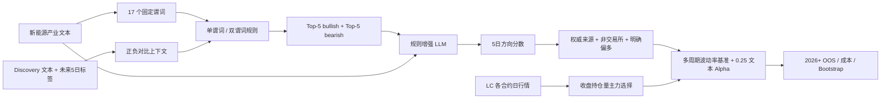
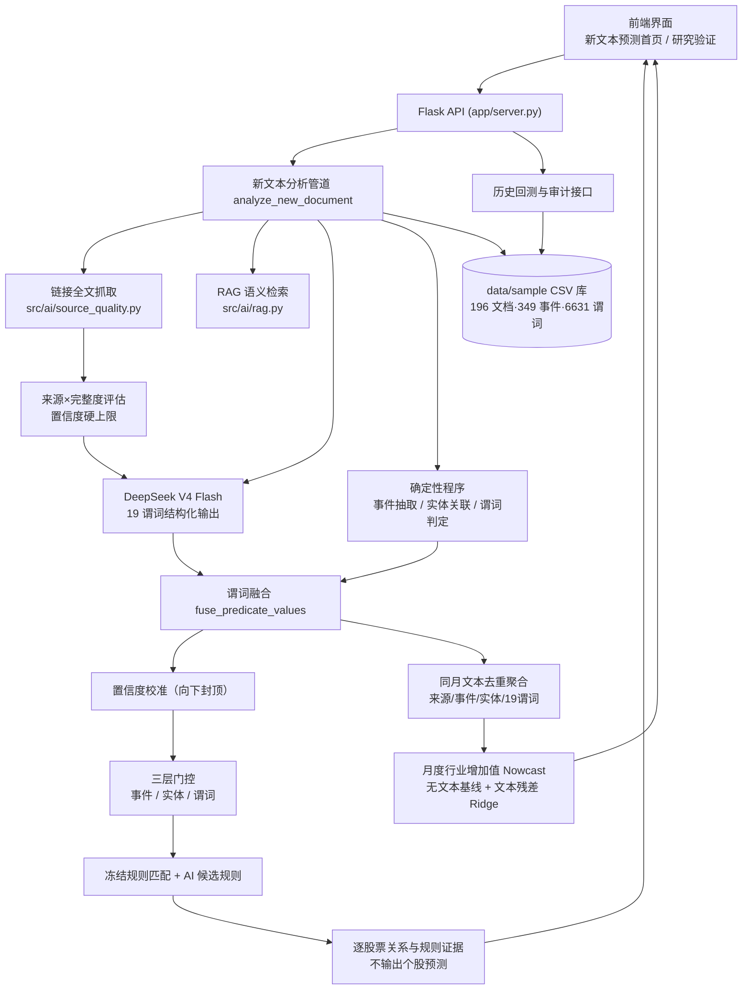

# AlphaLens 碳酸锂 RIFT 规则增强趋势研究平台

> **一句话定位**：AlphaLens 将新能源产业文本映射到固定碳酸锂谓词，通过 Discovery 样本归纳 RIFT 短规则，预测碳酸锂主力连续合约未来 5 个交易日价格方向，再检验规则增强趋势相对纯趋势是否产生严格样本外交易增量。
>
> 版本 `lithium-v6-quality-text-walkforward` · DeepSeek-V4-Flash 谓词与方向推理 · 17 谓词固定 Schema · 成熟市场基准 · 更强质量规则文本 Alpha · 追加式前瞻检验
>
> **本报告仅供研究参考，不构成投资建议**

## 当前实现状态

代码与真实数据链路均已落盘：8,507 条广期所 LC 合约日行情、652 个仓单交易日、744 个主力连续交易日，以及 449 篇可追溯文本。新增语料为 13 家锂矿/锂盐/电池产业链上市公司的 196 篇巨潮资讯公告，选取只使用发行人、标题和文档内容，不读取市场收益。全部 449 篇由 `deepseek-v4-flash` 标注固定谓词；259 篇 Validation/OOS 文本分别进行零样本与 RIFT 方向推理。谓词和方向证据都必须回映原文，无法验证的输出会降为 0 并写入审计。其中 445 篇具备可计算的未来 5 日标签。

5 个标签跨越冻结边界的 Discovery 文本已排除，剩余 181 个净化样本归纳出 1 条稳定规则：`仓单减少 -> bullish`。主方案 70/30 RIFT 在 2025 Validation 的成本后年化收益差为 -16.12%，95% 区间 `[-21.92%, -3.75%]`；在 2026 OOS 为 +7.14%，但 95% 区间 `[-1.16%, 42.48%]` 跨 0。辅助的“文本仅同向增强趋势”在 Validation 为 +0.70%，95% 区间 `[0.11%, 1.56%]`，但在 2026 OOS 为 -0.80%，95% 区间 `[-1.65%, -0.06%]`。两条路径都未通过主验收，因此当前结论是 **“交易增量未建立”**。

70/30 方案在文本分数为 0 时仍把趋势仓位缩放为 70%，所以其相对纯趋势的差异不能全部归因为文本 alpha。为消除该混淆，项目先在提交 `c6d26f4` 冻结了保持原趋势仓位的加法候选，再一次性打开 2026 OOS；结果为年化收益差 -3.62%，95% 区间 `[-17.12%, 13.75%]`，同样失败，不再基于该 OOS 调权重。

独立的 V4 前瞻账本已经启动。第一条决策使用 2026-08-14 广期所仓单日报真实数据，由 `deepseek-v4-flash` 在收盘后生成并写入 `data/research/lithium_v4_prospective_decisions.csv`：规则未激活，RIFT 分数为 0，LC2701 增强仓位与纯趋势仓位均为 0.3461。该记录等待下一真实交易日开盘后结算，不允许回填或改写。冻结前缀由 `data/research/lithium_v4_prospective_freeze.json` 校验；首次决策生成时尚未保存完整谓词上下文，因此在信号审计表中明确标为部分元数据，后续决策会保存完整的 DeepSeek 请求标识、谓词共识、证据与对比上下文。

V5 将规则质量分数与市场方向分数拆开，并用 20/60/120 日同合约动量、因果滚动标准化和 25% 年化波动率目标构成成熟市场基准。文本 Alpha 只接受 `authoritative_source AND non_GFEX AND zero_shot_score > 0` 的 DeepSeek 信号，并且只有在基准偏多时增加 `0.25 * text_score`；无合格文本时增强仓位与基准完全相同。5 bp 下，2025+ 回顾性滚动区间年化配对收益差为 +5.48%，Bootstrap 95% 区间 `[+1.46%, +13.39%]`；2026 历史压力段为 +5.59%，区间 `[+0.14%, +7.17%]`，2/10 bp 成本下界也保持为正。

上述 V5 数字证明了**历史模拟中的可归因交易增量**，但候选形成时历史结果已经可见，因此不冒充新的未见 OOS。候选源码、输入前缀、报告和首条决策已于 2026-08-15 冻结在 `lithium_v5_candidate_freeze.json`；首条 LC2701 决策在下一交易日开盘前写入 V5 账本，严格前瞻结论仍等待新增真实交易日。

在保留 V5 审计账本和成熟市场基准不变的前提下，系统新增 **V6 优化候选**：文本质量门禁收紧为 `authoritative_source AND non_GFEX AND zero_shot_score >= 0.2 AND NOT uncertainty_high`，并将文本 Alpha 权重从 0.25 提升到 0.35。V6 历史 walk-forward（2025+）年化配对收益差约 **+7.50%**，Bootstrap 95% 下界约 **+2.54%**；2026 压力段年化差约 **+9.30%**，95% 下界约 **+2.68%**。2/5/10 bp 成本敏感性均通过。候选源码、输入前缀、报告和首条决策冻结在 `lithium_v6_candidate_freeze.json`，严格结论仍只读取 2026-08-15 之后的 append-only 前瞻账本。

`lithium-prospective-v2` 的冻结文件和 append-only 决策账本仍保留为历史审计，但不与 V4 研究样本混用，也不作为新版增量证明。

### 受控数据

`data/sample/` 已包含以下三张受控输入及对应抓取/标注审计：

| 文件 | 必填内容 |
|---|---|
| `lithium_texts.csv` | 文本、首次公开日期、来源 URL、人工复核状态 |
| `lithium_contract_daily.csv` | LC 各合约 OHLC、结算价、成交量、持仓量、官方来源 |
| `lithium_warehouse_receipts.csv` | 碳酸锂仓单数量、变动与官方来源 |
| `lithium_text_sources.csv` | 冻结后新文本 URL 队列；新页面增量抓取，已审计全文直接复用 |

官方来源说明：[碳酸锂合约](https://www.gfex.com.cn/gfex/tsl/sspz.shtml)、[日行情](https://www.gfex.com.cn/gfex/rihq/hqsj_tjsj.shtml)、[仓单日报](https://www.gfex.com.cn/gfex/cdrb/hqsj_tjsj.shtml)。`scripts/fetch_gfex_lithium_data.py` 直连广期所页面使用的官方 JSON 接口，并把原始响应压缩保存在被 Git 忽略的 `data/raw/`；受控 CSV 逐行保存来源页，`lithium_gfex_fetch_audit.csv` 保存请求状态与 SHA-256。本次完整区间审计为 0 请求错误。

### 重建顺序

1. `python scripts/fetch_gfex_lithium_data.py --start 2023-07-21 --end 2026-08-14 --workers 1`：获取并审计官方行情与仓单。
2. `python scripts/build_lithium_text_corpus.py --start 2023-07-21 --end 2026-08-14`：抓取产业全文，并用 discovery 期 75 分位数冻结重大仓单事件阈值。
3. `python scripts/fetch_cninfo_lithium_texts.py --start 2023-07-21 --end 2025-12-31 --max-per-company 50`：获取并审计巨潮资讯产业链公告。
4. `DEEPSEEK_API_KEY=... ALPHALENS_LLM_MODEL=deepseek-v4-flash ALPHALENS_AI_JSON_MODE=object python scripts/build_lithium_v3_research.py`：生成受控谓词、净化 Discovery 规则簿、独立零样本/RIFT 方向信号与审计报告。
5. `python scripts/build_lithium_v5_walkforward.py`：重建成熟市场基准、质量规则文本 Alpha、成本敏感性与回顾性 walk-forward 报告；冻结后仅用于复核，不再调参。
6. 每个交易日 17:00 后运行 `DEEPSEEK_API_KEY=... ALPHALENS_LLM_MODEL=deepseek-v4-flash ALPHALENS_AI_JSON_MODE=object python scripts/update_lithium_v5_prospective.py`：先验证 V5 冻结候选，再调用 V4 更新器追加官方行情、仓单和当日 DeepSeek 推理，随后为同一最新交易日追加不可改写的 V5 基准/增强仓位。最新行情日已有决策时不会重复调用模型；中断恢复只允许发生在交易时点仍有效时。
7. `python scripts/build_lithium_v6_walkforward.py`：重建 V6 更强质量门禁、0.35 文本权重、成本敏感性与回顾性 walk-forward 报告；冻结后仅用于复核，不再调参。
8. 每个交易日 17:00 后运行 `DEEPSEEK_API_KEY=... ALPHALENS_LLM_MODEL=deepseek-v4-flash ALPHALENS_AI_JSON_MODE=object python scripts/run_daily_lithium_v6.py --end <最新日期> --days 7`：先抓取最近巨潮资讯锂产业链公告并写入非交易所前瞻信号，再验证 V6 冻结候选、推进官方行情并追加不可改写的 V6 基准/增强仓位与运行日志，最后输出严格验收监控。若只运行基准决策、跳过实时采集，可加 `--skip-live-collector`。
9. `python scripts/verify_lithium_v6_system.py`：复核 V5/V6 冻结完整性并输出 V6 当前状态；然后 `python 运行研究流水线.py` 重建宏观 legacy 与碳酸锂派生输出，`python 启动演示.py` 启动页面。

`scripts/update_lithium_prospective.py` 属于保留的 v2 冻结研究，仍依赖旧本地标注缓存，不进入本轮 V4 规则、方向信号或增量结论。本轮新增标注只允许通过显式 DeepSeek V4 命令或实时 `/api/lithium/analyze` 生成，不使用本地 Qwen 产物。

V4 每日更新会在 `lithium_v4_prospective_signals.csv` 和 `lithium_v4_prospective_decisions.csv` 分别追加完整模型信号与收盘后已知的主力合约、纯趋势仓位、文本分数和增强仓位。相同文本或信号日只能验证原记录，任一输入哈希、推理结果或仓位发生变化都会拒绝覆盖；前瞻收益只结算在下一交易日开盘前已经写入的决策，避免事后回填信号。每次更新摘要追加到 `lithium_v4_prospective_runs.csv`。

单文本页面勾选“写入前瞻信号账本”后，只有冻结日之后、带来源链接且实际返回模型为 `deepseek-v4-flash` 的结果会追加到 `lithium_v5_live_signals.csv`；历史示例、缺少 URL 或模型不符的请求不会进入前瞻样本。V5 每日决策同时锁定市场输入和文本信号输入哈希，API Key 从不写入账本。

实时 `/api/lithium/analyze` 使用 OpenAI-compatible/DeepSeek 网关并要求调用方提供 Key；它与离线研究使用同一协议：第一通只抽固定谓词，第二通独立生成零样本方向，仅当冻结规则激活时第三通才注入 rulebook 与 Discovery 对比上下文。V4 历史标注仅由显式研究命令生成，不在 Web 请求中静默重跑。旧 Qwen 产物不进入 v3 谓词、规则或回测。
单文本接口的两阶段合约是固定的：`predicted_variable` 返回 `lc_main_5d_open_to_open_direction_score`，`v5_strategy_mapping` 与 `v6_strategy_mapping` 分别返回文本公开日对应的成熟市场基准、质量规则状态、文本 Alpha、边际仓位和下一开盘执行日，`increment_evidence` 同时返回历史滚动证据与严格前瞻账本状态。页面不再自行套用仓位公式。

V5 与 V6 历史证据的验收均是成本后年化收益差为正且 3 个月时间块 Bootstrap 95% 下界大于 0；该门槛在回顾性 2025+ 与 2026 压力段均已通过。严格主结论只读取 2026-08-15 冻结后的 append-only 决策账本，在积累至少 63 个已结算交易日并通过同一门槛前，必须保持“严格前瞻交易增量待检验”。

## 新主链路



旧的月度行业同比 Nowcast 代码和 `/api/macro/*` 接口仍保留为 legacy 对照，但不再作为首页主叙事。

---

## Legacy v2 文档

以下内容记录改造前的月度行业同比 Nowcast，用于复现实验与旧接口审计；当前产品入口、主结论和验收口径以上方碳酸锂 RIFT 方案为准。

## 录屏演示视频

- **随项目视频**：[`演示视频/AlphaLens_演示录屏.webm`](演示视频/AlphaLens_演示录屏.webm)。这是基于本版本真实桌面/移动页面制作的 36 秒 v2.0-R1 界面导览，覆盖新文本首页、同比预测、策略回测、研究验证和研究边界；视频与源码、截图直接放在成果目录中，无需解压。
- **在线视频**：[GitHub 仓库内录屏](https://github.com/chiiiiiiing/Gonghangbei/blob/codex/demo-integration/%E6%BC%94%E7%A4%BA%E8%A7%86%E9%A2%91/AlphaLens_%E6%BC%94%E7%A4%BA%E5%BD%95%E5%B1%8F.webm)。
- **现场演示**：详见 [现场演示操作文档.md](现场演示操作文档.md)，包含首次安装、启动、冻结回放、实时 AI、故障排查和退场检查。

## 项目源码仓库

- GitHub：[`chiiiiiiing/Gonghangbei`](https://github.com/chiiiiiiing/Gonghangbei)（分支 `codex/demo-integration`）
- 本轮工行杯准备不处理 AtomGit 提交；保留另一比赛文件夹，不删除其既有材料。

---

## 一、产品文档

### 1.1 要解决的问题

量化研究中，政策、公告、新闻、互动问答等**非结构化文本**蕴含大量另类信息，但难以被机器直接使用：

| 痛点 | 传统做法 | AlphaLens 方案 |
|---|---|---|
| 文本难以映射实体经济 | 人工阅读、主观判断 | 同月去重文本 → 事件/谓词聚合 → 冻结月度模型 → 官方行业同比 Nowcast |
| AI 幻觉不可信 | 大模型输出不设防 | 19 谓词固定 Schema + 三层门控 + 逐字证据回溯 |
| 黑箱不透明 | 预测结论不知从哪来 | 每个预测特征可追溯至原文片段、来源、谓词与规则 |
| 研究结论容易等同交易结论 | 只展示策略收益 | 默认只输出行业同比预测与证据报告；保留的策略研究单独验收，Oracle 醒目标记不可交易 |

### 1.2 核心能力

1. **结构化抽取**：任意文本 → 主事件 + 关联股票 + 19 个标准谓词（政策支持、业绩异常、产能扩张等 9 类事件）。
2. **AI 深度参与但全程可审计**：DeepSeek V4 Flash 提出事件/谓词/规则候选；AI 谓词与确定性程序做**谓词融合**（一致采纳、冲突按 AI 置信度加权、AI 缺失回退规则值）。融合值仅用于展示与置信度分析；**冻结规则只接受 `agreed_true` 谓词门控**。
3. **来源与完整度校准**（R4.1）：有正文链接自动抓取全文供 AI 阅读；AI 按**政策类型 / 来源 / 链接 / 文本完整度**四维校准置信度，仅摘要时上限 0.6、全文+权威来源最高 0.95。
4. **月度聚合 Nowcast**：同一目标月的历史文本先按规范化 URL/正文指纹去重，再聚合来源、事件、实体和19谓词。用户新提交的一篇文本不是独立预测整个月，而是展示其进入本月聚合前后的 Nowcast 与仓位边际变化；重复文本贡献为零。旧候选因子字段仅在兼容 API 和底层流水线中保留，不进入同比回归，也不在结果页展示。
5. **逐股票关系审计**：同一文本下逐股票核验关联方式、AI业务相关性、行业代表度和原文证据，用于解释产业链映射；界面不再展示个股因子值或股票涨跌判断。
6. **RAG 语义检索**：实时分析检索 163 篇历史 AI 标注结论注入 prompt，参考相似历史研究。
7. **宏观预测差异配置**：在新能源 ETF `516160` 与5年期国债 ETF `511010` 之间连续配置；不使用价格趋势、不做空、不加杠杆，比较无同比信号、无文本同比模型和月度文本增强 Nowcast 三条策略。
8. **历史文本与完整审计**：新增106篇可核验历史全文，其中88篇国家统计局工业发布、18篇国家能源局/国家发展改革委等新能源政策；全部保存首次公开日期、正文URL和抓取审计，并生成626个事件、11,894条固定谓词。2015—2021训练，2022—2023验证。

### 1.3 三分钟演示

1. **新文本预测首页**：输入正文或链接，使用真实 DeepSeek Key 完成 AI 全链路，直接得到无文本同比基线、本篇加入前/后月度 Nowcast、90%区间和主要边际贡献。
2. **分析报告**：顶部展示本篇文本对本月 Nowcast 的边际影响；逐股票AI判断、关系证据、19谓词、门控和冻结规则保留在下方审计区；结果末尾展示不依赖价格趋势的三组策略回测；冻结回放始终标记回放。
3. **研究验证**：在同一页面查看106篇历史文本、训练/验证误差、数据覆盖、AI标注、冻结规则和时间边界；模型验证与研究审计不再拆成两个导航。

### 1.4 关键保证（可验证）

- 实时模式缺 Key / API 失败 / 未返回完整 19 谓词 → **直接报错**，不降级冒充。
- 三层门控（事件/实体/逐股票谓词），只有 `agreed_true` 触发冻结规则。
- 规则支持度按独立 `doc_id`、日期、股票覆盖共同判定。
- 回测按交易日横截面分组，收益为「个股 5 日收益 − 行业等权收益」。
- API Key 只随当次请求发送，不写入文件、CSV 或浏览器存储。
- 冻结回放使用已保存的结构化 AI 输出，页面持续标注「冻结回放」，不冒充实时结果。

---

## 二、系统架构



**模块职责**

| 模块 | 文件 | 职责 |
|---|---|---|
| 链接全文抓取 | `src/ai/source_quality.py` | HTML/PDF 尽力抓取，来源与完整度评估，置信度硬上限 |
| RAG 语义检索 | `src/ai/rag.py` | 内存向量索引，检索历史 AI 结论 |
| AI 研究层 | `src/ai/research_layer.py` | 调用 DeepSeek、结构校验、自动修复 |
| 新文本分析管道 | `src/pipeline/live_analysis.py` | 谓词融合、门控、兼容中间量计算、置信度校准 |
| 规则与评分 | `src/research/scoring.py` | 证据评分、冻结规则与历史研究兼容层 |
| 历史因子回测 | `src/backtest/demo_engine.py` | 保留兼容的横截面五组、Rank IC，不作为产品预测输出 |
| 历史文本层 | `src/macro/history.py` | 官方全文抓取、来源审计及同一确定性事件/谓词处理 |
| 宏观研究层 | `src/macro/engine.py` | 月度去重聚合、发布日期防泄漏训练、边际预测、配置与报告参数 |
| 服务端 | `app/server.py` | Flask API、冻结回放、审计、报告 |
| 前端 | `app/assets/app.js` | 交互界面、图表、下载报告 |

**数据口径**：输入受保护（`raw_documents.csv` 重算前后 SHA-256 强制比对）；行情为前复权日线；`adj_factor=1` 为占位字段并在审计页披露。

---

## 三、核心模块截图

| 模块 | 截图 | 说明 |
|---|---|---|
| v2 新文本预测首页（桌面） | `演示截图/7_v2_新文本预测首页_桌面.png` | 默认首页直接呈现正文、链接和运行配置 |
| v2 新文本预测首页（移动） | `演示截图/8_v2_新文本预测首页_移动.png` | 390×844 视口，无横向溢出 |
| v2 研究验证（模型区，桌面） | `演示截图/11_v2_模型验证页_桌面.png` | 合并页上半部分：官方历史目标、月度文本模型与无文本基线 |
| v2 单篇文本边际影响报告 | `演示截图/10_v2_单文本同比预测报告_移动.png` | 无文本基线、加入前/后 Nowcast、边际变化与主要贡献 |
| v2 同比预测结果（桌面） | `演示截图/12_v2_同比预测结果_桌面.jpg` | 顶部只展示同比预测、加速度与区间，旧因子摘要已移除 |
| v2 宏观预测差异配置（桌面） | `演示截图/13_v2_同比预测策略回测_桌面.jpg` | 无同比信号、无文本同比和文本增强 Nowcast 的成本后净值与指标 |
| v2 宏观预测差异配置（移动） | `演示截图/14_v2_同比预测策略回测_移动.jpg` | 390×844 视口，无横向溢出 |
| 新文本分析（R4.1 正文链接提示） | `演示截图/6_正文链接全文抓取提示.png` | 填链接自动抓全文，按完整度降置信度 |
| 新文本分析主页 | `演示截图/1_主页_新文本分析.png` | 文本输入、示例、运行配置 |
| 研究验证（审计区） | `演示截图/4_研究审计.png` | 合并页下半部分：分区覆盖、AI 缓存、冻结规则与未来函数 |

（全部截图位于 `演示截图/` 目录，可替换/补充实时 AI 分析结果。）

---

## 四、性能数据

### 4.1 数据规模（`/api/status` 与 `/api/macro/status` 实测，2026-08-10）

| 指标 | 数值 |
|---|---|
| 输入文档 | 196 篇（政策 55 · 公告 55 · 新闻 56 · 互动问答 30）|
| 事件 / 谓词 | 349 事件 · 6631 谓词（每个事件完整19项） |
| 股票关系池 / 兼容历史样本 | 30 只 · 113 样本（只用于底层审计，不作为同比预测标签） |
| 行情 | 18002 行日线（2024-01-02 ~ 2026-06-30）|
| 合格冻结规则 | 2 条（谓词优化后按冻结门槛重新筛选） |
| OOS 兼容审计截面 | 18 个有效 IC 截面（只作底层规则审计，不是同比预测指标） |
| 事件类型覆盖 | 9 类全覆盖；当前最大缺口为 Discovery 互动问答 0/25，待人工采集 |
| 历史 AI 标注缓存 | 163/196（83%），33 篇被严格校验拒绝，审计页如实显示 incomplete |
| 官方宏观目标 | 116 个可核验观测（2015-02 至 2026-06），原始发布链接逐行保存；检索未可靠定位的月份不补造 |
| 历史文本 | 106篇官方全文：统计发布88篇、政策18篇；106/106抓取和来源审计通过 |
| 历史月度聚合底层结构化结果 | 631条实体关联、626个事件、11,894条固定19谓词记录 |
| 策略行情 | `516160` 1334 行（东方财富接口）+ `511010` 2000 行（新浪财经接口），来源逐行披露 |

### 4.2 月度聚合 Nowcast 验证结果

| 层级 | 当前结果 | 结论 |
|---|---:|---|
| 训练集 | 2015—2021，共51个有文本覆盖的独立月份 | 同月文本去重聚合，一月一个目标样本 |
| 验证集 | 2022—2023，共20个有文本覆盖的独立月份；MAE 2.92pct，RMSE 3.42pct | 只用于选择有限特征集、正则与文本残差权重 |
| 无文本同比基线 | 同一验证月份 MAE 2.98pct | 文本增强验证 MAE 改善约0.05个百分点，增量较弱 |
| 新文本输出 | 加入前/后 Nowcast、边际变化、90%区间、仓位变化 | 不把一篇文本独立解释为整个月，不伪造未来收益 |

上述验证改善很小。2024年起的27个冻结OOS观测中，文本增强 MAE 为3.08pct，无文本模型为2.77pct，文本反而落后0.32个百分点；因此当前结论是“冻结OOS文本预测增量不足”，不能宣称稳定预测能力。

### 4.3 接口与运行性能

| 接口 | 耗时 | 说明 |
|---|---|---|
| `/api/status` | 74 ms | 读取全部 CSV 汇总 |
| `/api/backtest` | 2 ms | 历史回测结果 |
| `/api/audit` | 50 ms | 审计数据 |
| `/api/macro/status` | 本地毫秒级 | 目标、分区与证据状态 |
| `/api/macro/forecast` | 本地毫秒级 | 历史预测、区间与指标 |
| `/api/macro/backtest` | 本地毫秒级 | 策略权重、净值与 Bootstrap |
| `/api/replay/<case>` | 21 ms | 冻结回放完整分析 |
| 链接全文抓取（gov.cn 政策） | **0.19 s** / 4048 字 | R4.1 新增 |
| 链接全文抓取（巨潮 PDF 公告） | **0.37 s** / 5756 字 | R4.1 新增，pypdf 抽取 |
| DeepSeek 实时全链路验收 | 2026-08-10，HTTP 200 | `/models`、实际返回模型、request_id、system_fingerprint 校验通过；政策全文分析关联 5 只股票，完成逐股票 19 谓词校验；门控未通过时如实不触发冻结规则 |

### 4.4 质量与可复现性

- 自动化测试覆盖原 AI/19谓词/门控链路及新增宏观接口、1—2月合并、发布日期防泄漏、分区冻结、策略权重、Oracle 标签与 Bootstrap；最终通过数以本次交付核验输出为准。
- `compileall` 全量编译通过。
- 唯一允许的 `运行研究流水线.py` 已完成33个样例CSV重算；入口在运行前后强制核对 `raw_documents.csv` SHA-256，本轮哈希保持 `9af278fa…2179`。
- 代码规模：src + app 约 5000 行 Python，前端单页应用，无第三方数据库依赖。

---

## 五、商业化说明

### 5.1 落地场景

1. **产业景气研究**：把本次输入的一篇政策、公告、新闻或互动问答转换成可审计证据，预测尚未发布的官方行业同比指标。
2. **产业政策与公司映射**：保留逐股票关系证据、原文证据和19谓词门控，解释文本如何映射产业链，但不输出候选因子值或股票涨跌预测。
3. **AI 合规投研**：AI 生成结论全程可审计、可追溯、可回放，满足金融机构对「模型输出可解释、不可黑箱」的合规要求。
4. **研究与教学平台**：高校金融工程实验室、量化课程的可复现研究台（冻结回放尤其适合教学演示）。

### 5.2 目标客户

| 客户类型 | 需求 | AlphaLens 价值 |
|---|---|---|
| 中小型量化私募 | 缺产业景气研究能力 | 即插即用的文本结构化与行业同比预测研究台 |
| 券商研究所 / 财富管理 | 研究自动化、覆盖政策公告 | 新文本→可审计证据→行业同比预测→报告 |
| 资管科技团队 | 宏观信号需可验证、可审计 | 发布日期防泄漏 + 冻结模型 + 策略增量检验 |
| 高校金融实验室 | 教学可复现 | 冻结回放 + 完整口径文档 |

### 5.3 商业模式

1. **SaaS 订阅制**：按行业覆盖、文档处理量 / API 调用数分层计费（基础版免费试用，专业版按文档量月费）。
2. **私有化部署授权**：面向券商、资管等对数据安全敏感的机构，本地化部署 + 年授权费。
3. **产业预测数据订阅**：输出标准化月度聚合特征、预测区间、单篇边际贡献与事件库 API，按行业和文档量订阅。
4. **增值服务**：定制行业预测目标、行业专属政策映射和研究系统集成。

> 说明：当前为研究演示版本，实际商用需补齐权限体系、多租户、数据授权合规与生产级运维。

---

## 六、启动与验证

工行杯成果目录已直接包含源码，不需要解压。需要 Python 3.9+：

```bash
python3 -m venv .venv
.venv/bin/pip install -r requirements.txt
.venv/bin/python 启动演示.py
# 浏览器打开 http://127.0.0.1:8701
```

现场建议先使用不联网的“冻结回放”展示完整链路；需要演示实时 AI 时，再使用可公开文本和有效的 DeepSeek Key。Key 只随本次请求发送，不写入项目或浏览器存储。完整逐步操作见 [现场演示操作文档.md](现场演示操作文档.md)。

### 安全重算

重建实体、事件、谓词、规则与回测结果时，只运行 `运行研究流水线.py`（不生成 `raw_documents.csv`，重算前后 SHA-256 强制比对）。

### 可选能力

```bash
# 本地 BGE 语义检索（未安装时自动降级到字符 n-gram）
.venv/bin/pip install -r requirements-ai.txt
ALPHALENS_BGE_ALLOW_DOWNLOAD=1 .venv/bin/python 准备本地向量模型.py

# 历史 DeepSeek 标注缓存（需 Key）
DEEPSEEK_API_KEY=你的Key .venv/bin/python 批量生成AI标注.py --limit 10

# Discovery 互动问答候选：仅写 data/external 暂存区，逐条人工确认后才可导入
.venv/bin/python 采集Discovery互动问答候选.py
```

候选采集器只写 `data/external/`，以官方接口的**实际返回日期**为准再次过滤，并要求详情中的股票代码、提问时间、提问和公司回复都完整；不把接口请求参数当作历史归档证明。2026-08-10 的 3 只股票小范围联网验收返回 0 条 2024–2025 合格候选，报告保留在外部暂存区；因此 Discovery 互动问答缺口仍为 0/25，需取得可核验的官方历史详情页后人工复核，不能以 OOS 或重复文本填补。提交包内提供了不含数据的 [人工核验模板](采集模板/Discovery互动问答采集模板.csv)。

### 验证

```bash
.venv/bin/python -m unittest discover -s tests -v   # 58 个测试
.venv/bin/python -m compileall -q app src tests 运行研究流水线.py
```

---

## 七、文件结构

```text
├── app/                    # Flask API、前端资源、本地依赖
├── src/                    # AI、链接抓取、抽取、评分与回测源码
├── data/sample/            # 演示数据、回放、研究输出
├── tests/                  # 自动化验收测试
├── 演示截图/                # 核心模块截图
├── 演示视频/                # 与本版本界面对应的操作录屏
├── 启动演示.py             # 统一启动入口
├── 运行研究流水线.py       # 受 SHA-256 保护的重算入口
├── 导入真实文本.py / 更新真实行情.py / 批量生成AI标注.py / 检查数据覆盖.py
├── 采集Discovery互动问答候选.py # 官方问答候选暂存，返回日期二次校验，不触碰 raw
├── 采集模板/               # 受控空白导入模板（不含外部或人工核验数据）
├── VERSION                 # 版本标签
├── 现场演示操作文档.md      # 现场开机、启动、演示、排障与退场步骤
└── README.md               # 唯一总说明：产品、技术、提交、商业化与限制
```

`工行杯_AlphaLens/` 即完整可演示成果目录：源码、样例数据、README、操作文档、截图和视频均直接可见，不再提供 ZIP。目录明确排除 `.git`、`.venv`、`data/raw`、`data/processed`、`data/external`、API Key、缓存和临时文件。

---

## 八、完整技术与提交说明

### 8.1 工行杯交付对应关系

| 可演示成果 | 交付位置 | 状态 |
|---|---|---|
| 可运行 Agent 应用 | 根目录源码、`requirements.txt`、`启动演示.py`、`data/sample/` | 已直接放置，无需解压 |
| v2.0-R1 界面导览视频 | `演示视频/AlphaLens_演示录屏.webm`，README 顶部提供链接 | 已纳入；现场完整操作步骤另见操作文档 |
| 产品与技术文档 | 本 README 的产品、架构、模块、数据、API、性能、限制章节 | 已合并为唯一总说明 |
| 核心模块截图 | `演示截图/` | 桌面与移动视口均覆盖 |
| 商业化说明 | 本 README 第五章 | 已纳入 |
| 现场操作说明 | `现场演示操作文档.md` | 已纳入 |

本目录只整理工行杯可演示成果，不含 PPT，不处理另一比赛的提交流程。

### 8.2 固定 19 谓词 Schema

| 类别 | 谓词 |
|---|---|
| 政策 | `has_policy_support`、`policy_directly_related_to_business`、`event_policy_binding_strength`、`demand_side_policy`、`supply_side_policy`、`capacity_policy_support`、`policy_attention_followup` |
| 来源 | `evidence_from_authoritative_source`、`source_company_announcement`、`source_major_media` |
| 事件内容 | `event_mentions_core_product`、`event_scale_industry_level`、`event_mentions_export`、`event_has_quantitative_target` |
| 关注度 | `investor_questions_increase` |
| 风险 | `announcement_contains_uncertainty`、`risk_or_uncertainty_disclosure` |
| 数值 | `event_evidence_strength`、`event_has_short_term_price_impact` |

每只关联股票必须返回完整且不重复的 19 个谓词。缺项、类型非法、股票代码非法或证据无法在原文连续定位时，实时模式直接失败；系统不会用确定性结果冒充 AI 成功。

### 8.3 三层门控与可解释证据

1. **事件门控**：确定性事件与 AI 事件一致，或 AI 事件在合法枚举内且证据可回溯；冲突事件被拒绝。
2. **实体关系门控**：股票代码必须是股票池内的六位字符串；关系证据必须是原文连续子串，关系置信度不得低于阈值。
3. **谓词门控**：只有 AI 与确定性程序一致为真的 `agreed_true` 谓词可触发冻结规则。`agreed_false`、`disputed` 和 `invalid` 均不能触发。

AI 与确定性程序的冲突融合值只用于界面解释和置信度校准，不能绕过门控。逐股票关系仍用于解释产业链映射，但网页不输出个股因子值、涨跌预测或买卖建议。

### 8.4 实时 AI 的作用与身份校验

实时 AI 不是直接猜测同比数值。它负责阅读用户输入或抓取后的 HTML/PDF 全文，结合 RAG 历史标注，逐股票提出事件、关系证据和 19 谓词结构化判断；确定性程序随后独立生成结果，并通过门控进行交叉核验。通过校验的结构化证据才会进入冻结的同比预测模型。

模型固定为 `deepseek-v4-flash`。连接检查同时核对 `/models`、请求模型、实际返回模型、`request_id` 和 `system_fingerprint`。缺少 Key、调用失败、模型不符或 JSON 不合法均明确报错。冻结回放使用保存的结构化响应，始终显示“冻结回放”，不冒充当次联网调用。

### 8.5 同比预测、时间分区与未来数据防护

目标为国家统计局“电气机械和器材制造业增加值同比增速”。模型使用同月去重文本聚合出的来源、事件、实体、谓词和规则特征，输出月度同比 Nowcast、相对最新已公布值的加速度与90%区间；新输入只展示加入前后预测和仓位的边际变化。1—2月官方合并值作为一个观测，不人工拆分。

- 2015—2021：训练与规则发现；
- 2022—2023：月度文本特征集、正则强度、残差权重和策略信号尺度验证；
- 2024—最新：冻结样本外观察，不能反向调参；
- 每条训练特征都经过 `published_at <= target_release_date` 检查；预测时只使用当时已经公开的文本和官方值；
- 同月文本先按来源URL/正文指纹去重后聚合，每月只对应一个官方目标；用户本次输入只新增一次证据贡献并展示边际变化；
- 旧候选因子字段仅为兼容 API 和可审计中间层，不进入同比回归标签。

因此，当前实现没有把下一期官方值、未来文本或未来市场价格作为机器学习输入。测试覆盖发布日期防泄漏、分区冻结和入场时间边界；任何边界失败都应阻止结果被认定为有效。

### 8.6 量化策略检验

策略是新能源 ETF `516160` 与5年期国债 ETF `511010` 的宏观预测差异配置：

- 月末收盘后计算，下一交易日调仓；
- 不读取12个月价格趋势；使用无文本同比预测变化和文本预测增量的连续 `tanh` 映射决定新能源仓位；
- 固定50%新能源/50%国债作为“无同比信号”基准，无文本同比模型作为核心基准；
- 新能源仓位限制在0—100%，不做空、不加杠杆；
- 主结果扣除单边 10bp 成本，并报告 5bp、20bp 敏感性；
- 仓位映射不按收益优化；尺度只由2022—2023验证期预测分布确定，2024年起冻结。

核心验收是月度文本增强配置相对无文本同比模型配置的成本后差异。

当前48个月、单边10bp成本的完整回测中：无同比信号年化收益 **-4.80%**，无文本同比模型 **-6.80%**，月度文本增强 Nowcast **-15.94%**。文本增强相对无文本模型的Bootstrap年化净收益差为 **-11.20个百分点**，95%区间约 **-23.96% 至 1.32%**。结果明确表明当前文本预测未形成交易增量；系统如实保留负结果，不通过收益调参寻找“显著”策略。

### 8.6.1 交易增量诊断（2026-08-13）

在保留现有 AI、19 谓词、三层门控与月度 Nowcast 流水线的前提下，做了防未来数据的诊断与候选规则复评（详见 [`交易增量诊断报告.md`](交易增量诊断报告.md)）：

- **亏损归因**：底层是资产 beta 不利——样本内 `516160` 几何年化约 -14.36%、`511010` 约 +2.66%，固定 50/50 仍为 -4.79%；无文本加速信号与文本增量在 OOS 方向命中率均低于 50%，文本增量的 `tanh` 尺度饱和进一步放大亏损。换手成本拖累仅约 0.2 个百分点/年，不是主因。
- **候选规则复评**：尺度标准化、有界线性/分段映射、符号规则、文本增量阈值确认、月度换手上限均按验证期（2022—2023）选参、2024 年起冻结，并在 5/10/20bp 成本敏感性下复核；无一候选在冻结 OOS 同时满足“相对 `no_text_yoy` 正年化净收益差”与“3 个月时间块 Bootstrap 95% 下界 > 0”的采用标准。
- **最终结论**：**当前宏观预测暂不能形成交易增量**。生产配置保持三组对照并如实披露负结果，文本模型仅保留产业研究价值；可复现脚本为 `src/macro/trading_increment_research.py`。

### 8.7 API 一览

| 方法 | 路径 | 用途 |
|---|---|---|
| `GET` | `/` | 默认新文本预测页面 |
| `GET` | `/api/status` | 数据、版本与免责声明 |
| `POST` | `/api/ai/check` | DeepSeek 权限与真实模型身份检查 |
| `POST` | `/api/analyze` | 兼容的新文本 AI 分析接口 |
| `GET` | `/api/replay/<case_id>` | 强制标记的冻结回放 |
| `GET` | `/api/macro/status` | 宏观目标、分区和证据状态 |
| `POST` | `/api/macro/analyze` | 新文本 AI 全链路与同比预测 |
| `GET` | `/api/macro/forecast` | 历史目标、冻结预测与指标 |
| `GET` | `/api/macro/backtest` | 策略权重、净值、成本和 Bootstrap 指标 |
| `GET` | `/api/audit` | 数据覆盖、规则、AI 缓存与未来函数审计 |

### 8.8 第三方依赖、安全与限制

- 运行时：Python 3.9+、Flask、Plotly.js、Lucide；可选 sentence-transformers、BGE 与 AkShare。
- 外部服务：DeepSeek API。联网实时分析会将当次公开文本发送给 DeepSeek；API Key 不写入文件、CSV、日志或浏览器存储。
- 样例行情价格为前复权口径；`adj_factor=1` 是已接受的占位字段，并不是真实复权因子序列。
- Discovery 互动问答仍为 0/25，不复制文本虚增支持度；历史 AI 缓存 163/196，33 篇因严格金融语义、证据或结构校验被拒绝，不能通过放宽校验伪造覆盖。
- 预测验证样本仍有限；结果用于产业研究，不能宣称可稳定预测未来，也不能由策略历史表现推导投资收益承诺。
- 工行杯成果目录不包含 `.git`、`.venv`、`data/raw`、`data/processed`、`data/external`、API Key、缓存和临时文件。

### 8.9 提交前核查

- [x] 版本统一为 `AlphaLens-Demo-v2.0-R1`。
- [x] 原 AI、19谓词、三层门控和冻结规则链路保留。
- [x] 默认首页输出行业同比预测，不展示旧个股因子值。
- [x] 模型验证与研究审计合并，桌面与移动端均检查。
- [x] README 合并产品说明、完整技术说明、提交说明与商业化说明。
- [x] 源码和样例数据直接放入工行杯成果目录，不使用 ZIP。
- [x] 冻结回放与实时 AI 明确区分，Key 不持久化。
- [x] 所有页面与报告保留免责声明。

---

**AlphaLens 预测行业实体景气，不预测股票价格，不提供买卖建议。**

**本报告仅供研究参考，不构成投资建议**
