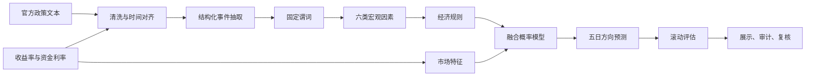

# 技术方案与因素字典

## 流程图

## 因素字典

| 因素 | 固定谓词 | 默认方向 | 典型证据 |
| --- | --- | --- | --- |
| 货币政策 | `policy_stance_eases` / `policy_stance_tightens` | 宽松向下、收紧向上 | 降准、降息、适度宽松、收紧 |
| 市场流动性 | `liquidity_supply_increases` / `liquidity_supply_decreases` | 投放向下、回笼向上 | 逆回购、净投放、资金面偏紧 |
| 经济增长 | `growth_outlook_strengthens` / `growth_outlook_weakens` | 增强向上、走弱向下 | PMI 扩张、需求改善、经济下行 |
| 通胀 | `inflation_pressure_rises` / `inflation_pressure_falls` | 上升向上、回落向下 | CPI/PPI 回升或下降 |
| 债券供给 | `government_bond_supply_rises` / `government_bond_supply_falls` | 增加向上、减少向下 | 国债或地方债发行变化 |
| 风险偏好 | `risk_aversion_rises` / `risk_aversion_falls` | 避险上升向下、风险偏好回升向上 | 不确定性增加或缓解 |

所有方向均指对 10 年期国债收益率的压力。收益率下行通常对应债券价格偏强，收益率上行通常对应债券价格偏弱。

## 规则

1. 货币政策宽松且流动性投放增加：增强收益率下行压力。
2. 政策边际收紧：增强收益率上行压力。
3. 增长预期和通胀压力同步增强：增强收益率上行压力。
4. 政府债供给增加：增强收益率上行压力。
5. 避险需求上升：增加利率债需求，增强收益率下行压力。

只有包含原文证据且不存在抽取冲突的谓词才允许触发规则。
