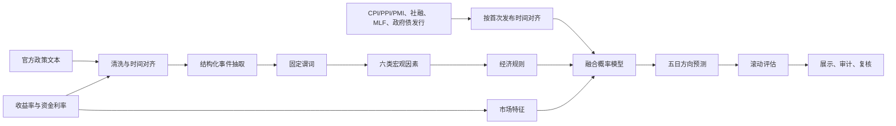

# 技术方案与因素字典

规则版本：`rates-rulebook-v1.0-20260902`

统一口径：因素和规则的正值表示 10 年期国债收益率上行压力，负值表示下行压力。收益率方向与债券价格方向相反。

## 流程图

## 因素字典

| 因素 | 固定谓词 | 默认方向 | 典型证据 |
| --- | --- | --- | --- |
| 货币政策 | `policy_stance_eases` / `policy_stance_tightens` | 宽松向下、收紧向上 | 降准、降息、适度宽松、收紧 |
| 市场流动性 | `liquidity_supply_increases` / `liquidity_supply_decreases` | 投放向下、回笼向上 | 逆回购、净投放、资金面偏紧 |
| 经济增长 | `growth_outlook_strengthens` / `growth_outlook_weakens` | 增强向上、走弱向下 | PMI 扩张、需求改善、经济下行 |
| 通胀 | `inflation_pressure_rises` / `inflation_pressure_falls` | 上升向上、回落向下 | CPI/PPI 回升或下降 |
| 债券供给 | `government_bond_supply_rises` / `government_bond_supply_falls` | 增加向上、减少向下 | 国债或地方债发行变化 |
| 风险偏好 | `risk_aversion_rises` / `risk_aversion_falls` | 避险上升向下、风险偏好回升向上 | 不确定性增加或缓解 |

所有方向均指对 10 年期国债收益率的压力。收益率下行通常对应债券价格偏强，收益率上行通常对应债券价格偏弱。

市场流动性还包含 `funding_conditions_ease` 与 `funding_conditions_tighten` 两个资金价格谓词，因此冻结 Schema 共 14 个谓词。大模型不得临时创造新谓词。

## 12 条冻结规则

| ID | 条件 | 收益率方向 | 权重 |
| --- | --- | ---: | ---: |
| `R-MP-LIQ-01` | 政策宽松 + 流动性投放 | 下行 | 1.00 |
| `R-MP-EASE-02` | 政策宽松 | 下行 | 0.65 |
| `R-MP-TIGHT-01` | 政策收紧 | 上行 | 0.80 |
| `R-LIQ-EASE-01` | 流动性投放 + 资金趋松 | 下行 | 0.90 |
| `R-LIQ-TIGHT-01` | 流动性回笼 + 资金趋紧 | 上行 | 0.90 |
| `R-GROWTH-INF-01` | 增长增强 + 通胀上升 | 上行 | 1.00 |
| `R-SLOW-INF-01` | 增长走弱 + 通胀回落 | 下行 | 1.00 |
| `R-SUPPLY-01` | 政府债供给增加 | 上行 | 0.70 |
| `R-SUPPLY-LIQ-02` | 政府债供给增加 + 资金趋紧 | 上行 | 1.00 |
| `R-RISK-01` | 避险需求上升 | 下行 | 0.65 |
| `R-RISK-GROWTH-02` | 避险上升 + 增长走弱 | 下行 | 0.90 |
| `R-REFLATION-01` | 风险偏好回升 + 增长增强 | 上行 | 0.80 |

## 证据和冲突门槛

1. LLM 必须返回完整固定谓词集合；不完整输出整条降级。
2. 激活谓词必须带逐字存在于标题或正文的证据。
3. LLM 与确定性提取方向冲突时标记 `disputed`，不得进入因素或规则。
4. 每篇文本按标题与正文指纹去重，并按 2 个交易日半衰期、最多 5 个交易日影响窗口聚合。

只有包含原文证据且不存在抽取冲突的谓词才允许触发规则。

## 规则生成路线选择

组内讨论的两条候选路线是：

1. **历史归纳后冻结**：只用发现期/验证期文本提出候选规则，经金融逻辑审核、最低独立事件数和时间留出检验后形成版本化规则簿；预测时不再改写。
2. **新文本动态生成**：每次输入文本时由大模型临时提出规则并评分。

V1 预测链选择“版本化冻结规则簿”，不允许新文本动态改写规则。当前12条规则来自金融传导先验与人工审核，并非宣称已从历史样本自动学得；大模型只负责固定事件/谓词抽取。原因是动态规则难以复现和审计，还可能让同一文本在不同调用中改变模型定义，而当前非流动性事件样本也不足以支持高自由度规则挖掘。

现有 `fusion` 与 `fusion_rules` 是“无规则压力/加入冻结规则压力”的可复现对照。回顾性时间留出中两者准确率均为43.90%、Macro-F1均为0.3317，AUC分别为0.5133和0.5207，尚未建立规则增量。它不等同于“历史自动归纳规则/动态LLM规则”的正式双路线实验；如后续仍需该实验，必须预先锁定协议并在2026-09-03后的新样本上顺序验收，不能回看时间留出结果再选择规则。

本报告仅供研究参考，不构成投资建议
