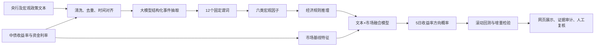

# 技术流程与论文方法迁移

## 大语言模型如何使用

大语言模型负责语义理解，不直接负责交易决策。它从政策文本中抽取主体、措施、对象、方向、强度、作用期限、证据原文和置信度，并映射到固定谓词。系统要求证据必须逐字出现在原文；模型不可用时明确降级为确定性词典，不会把关键词结果包装成大模型输出。

## 论文方法如何迁移

保留原项目“谓词抽取—规则归纳/推理—零样本语义判断—规则增强量化”的技术路线，但替换研究对象和经济机制：

- 从新能源产业文本改为央行、财政和宏观政策文本。
- 从碳酸锂期货方向改为10年期国债收益率五日方向。
- 从供需库存谓词改为货币政策、流动性、增长、通胀、债券供给和风险偏好谓词。
- 从交易仓位输出改为银行利率债投研概率、因素贡献和证据链。
- 通过市场基线、仅文本、文本市场融合、融合加规则四条路线，检验文本是否提供增量价值。

## 时间与审计约束

- 只使用当日17:30前已经公开的信息形成当日收盘信号。
- 收盘后或非交易日发布的文本映射到下一交易日。
- 回测按时间扩展窗口训练，禁止随机打乱。
- 每条数据保存来源网址、获取时间和SHA-256；每个文本因子保存原文证据。
