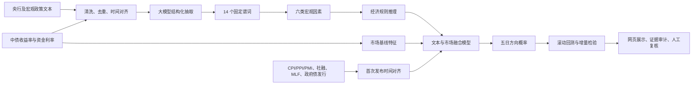

# AlphaLens 完整说明文档

> 版本：`rates-text-factor-submission-v2`
>
> 本系统仅供研究参考，不构成投资建议或自动交易指令。

## 1. 项目定位

AlphaLens 面向银行金融市场部、债券研究、交易支持、资产负债管理和市场风险人员。系统将分散的央行及宏观政策文本转化为可审计的量化因素，并检验这些因素能否在传统市场指标之外提供预测增量。

系统不让大模型直接预测价格或发出交易指令。大模型负责语义抽取，固定规则负责经济机制约束，低容量统计模型负责概率估计，时间滚动回测负责验证。

## 2. 研究契约

| 项目 | 定义 |
| --- | --- |
| 主目标 | 未来第 5 个交易日的 10 年期国债收益率方向 |
| 分类 | 上行、震荡、下行 |
| 阈值 | `> +2bp` 上行，`< -2bp` 下行，其余震荡 |
| 流动性输入 | DR007；当前历史快照以 FDR007 定盘利率作公开代理 |
| 文本截止 | 当日 17:30 前公开的信息进入当日；其后或非交易日信息进入下一交易日 |
| 训练方式 | 最多 756 个交易日的清洗滚动窗口，不随机打乱；五日标签在可观测后才进入训练 |
| 单文本输出 | 加入文本前后概率变化，不宣称单篇文本独立预测市场 |

## 3. 技术流程

## 4. 大语言模型的作用

大语言模型抽取事件主体、措施、对象、政策方向、强度、作用期限、证据原文和置信度，并映射到固定谓词。系统执行三层约束：

1. 谓词名称必须属于冻结 Schema。
2. 激活谓词必须提供逐字存在于输入文本的证据。
3. 大模型与确定性程序冲突时标记为 `disputed`，不进入因素分数和规则。

未配置或无法访问模型时，页面明确显示“确定性降级”，不会把词典结果包装为大模型结果。

## 5. 因素和规则

六类因素全部采用“对收益率的压力方向”口径：正值为收益率上行压力，负值为下行压力。

- 货币政策：宽松向下，收紧向上。
- 市场流动性：投放向下，回笼向上。
- 经济增长：增强向上，走弱向下。
- 通胀：上升向上，回落向下。
- 债券供给：增加向上，减少向下。
- 风险偏好：避险上升向下，风险偏好回升向上。

当前冻结规则版本包含 12 条规则，覆盖货币政策、流动性、增长与通胀共振、政府债供给和风险偏好等机制。规则必须有原文证据且不存在冲突才能触发。

## 6. 模型与评估

系统比较四条相同切分的路线：市场数据基线、仅文本因素、市场+文本+结构化宏观、融合加冻结规则。低容量多分类 Ridge 模型输出三类概率；融合路线以90%市场基线锚定并叠加10%文本模型，规则路线再加入0.15固定logit先验。评估包括Accuracy、Macro Precision/Recall/F1、每类指标、one-vs-rest AUC、Brier、混淆矩阵、概率校准、分时期结果和典型案例。

正式评估使用5日embargo，并每5个交易日取一个预测起点。当前四条路线均完成381个非重叠滚动预测观测，其中2025年至最新的回顾性时间留出有82个观测。市场基线、文本融合、规则增强的时间留出准确率依次为57.32%、58.54%、59.76%，Macro-F1依次为0.3938、0.3998、0.4275。最终路线准确率差Bootstrap 95%区间为`[0.00%, 6.10%]`，因此结论为“观察到正向点估计，但统计证据尚不足”。增强参数于2026-09-07冻结，真正前瞻OOS从冻结后的新数据累计。

## 7. 数据与审计

市场快照来自中债收益率曲线和中国货币网，包含2018-01-02至2026-09-04的2164个交易日。政策文本来自中国人民银行、国家统计局和财政部，包含2015-01-22至2026-09-01的780篇去重文本。另有4669条结构化宏观与政府债观测；MLF官方公告和政府债计划发行可入模，缺少历史vintage的CPI/PPI/PMI、社融镜像与追溯表仅审计。项目保存来源URL、下载时间、正文哈希、生效交易日、触发谓词和证据片段。当前语料匹配404条LLM缓存，其中363条通过证据门控；最终模型事件由通过门控的谓词重建。早于市场样本起点的201篇文本只参与语料审计。

FDR007是DR007历史公开代理，不等同于原始DR007。正式生产研究仍需经授权的完整DR001/DR007、逐期point-in-time宏观数据、更多独立政策事件以及人工抽取验收。2025年后的回顾性时间留出不得包装为真正OOS；前瞻OOS只能从2026-09-07增强版本冻结后顺序累计。

## 8. 系统实现

- `app/server.py`：只暴露利率债研究接口和静态页面。
- `src/rates/schema.py`：目标、字段、谓词和时间规则。
- `src/rates/factors.py`：确定性谓词、证据匹配和模型冲突处理。
- `src/rates/rules.py`：经济规则。
- `src/rates/modeling.py`：标签、特征、滚动训练和评估。
- `src/rates/engine.py`：状态、预测、回测、单文本分析和复核记录。
- `src/rates/llm.py`：可选的大模型结构化抽取。

## 9. 已知限制

- 文本已覆盖人民银行、国家统计局和财政部，但人民银行公开市场操作文本仍明显占优，流动性事件数远高于其他因子。
- 模型期内债券供给文本因子没有达到 5 个独立事件的最低门槛，系统已标记为“证据不足”并从模型与依赖规则中排除；其余因子覆盖仍明显不均。
- LLM 降级样本以及通过抽取的样本仍需分层人工抽检。
- CPI/PPI/PMI 当前数值由公开数据中心镜像获取；正式生产应优先替换为国家统计局可稳定直连的原始文件。
- 当前网页展示的是研究概率，不是收益承诺或实际交易信号。
- 政府债供给规则虽保留在冻结规则簿中，但当独立债券供给文本事件不足最低门槛时不进入模型。
- 震荡阈值 `±2bp`、五日窗口和文本覆盖门槛仍应结合专家意见进行稳健性检验。
- 人工复核写入本地运行目录，不替代银行内部审批与模型风险管理流程。

本报告仅供研究参考，不构成投资建议
